# Studying Style Relearning After Style Erasure in Diffusion Models: A Van Gogh Case Study

## Motivation
Recent concept erasure methods can suppress a target style in a diffusion model, but it is unclear how robust that erasure is after downstream fine-tuning.  
This project focuses on whether an erased artistic style can re-emerge through small-scale, indirect fine-tuning, and what kind of synthetic data is sufficient to trigger that recovery.

## Research Question
Can a diffusion model that has undergone style erasure relearn a Van Gogh-like style through downstream fine-tuning on synthetic, style-adjacent data that never explicitly names the artist?

## High-level Overview
The project begins by applying ESD-x to Stable Diffusion 1.4 to erase the target style, Van Gogh, and obtain an unlearned model. 
In parallel, GPT-5.4 is used to define ten semantically related concepts associated with the erased style and to generate prompts for each concept without explicitly using the artist name. 

These prompts are then passed to Stable Diffusion 3.5 to produce a synthetic image dataset. Finally, the unlearned SD 1.4 model is fine-tuned on this synthetic dataset to examine whether Van Gogh-like style features can be relearned indirectly through downstream training.

```mermaid
flowchart LR

  %% Left side: unlearning path
  M1[[SD 1.4]]
  P1([ESD-x fine-tuning for style erasure])
  D1[/Target style: Van Gogh/]
  M2[[Unlearned SD 1.4]]
  P6([Learn / recover style-relevant features])
  M5[[Unlearned + Fine-tuned SD 1.4]]

  %% Right side: synthetic data construction path
  M3[[GPT-5.4]]
  P2([Generate semantically related concepts])
  D2[/10 semantically related concepts/]
  P3([Sort concepts by closeness or importance])
  P4([Generate prompts without using the target artist name])
  D3[/X prompts per concept/]
  M4[[SD 3.5]]
  P5([Generate synthetic images])
  D4[/X*10 synthetic images/]

  %% Flows
  M1 --> P1
  D1 --> P1
  P1 --> M2
  M2 --> P6
  P6 --> M5

  M3 --> P2
  P2 --> D2
  D2 --> P3
  P3 --> D2
  D2 --> P4
  P4 --> D3
  D3 --> M4
  M4 --> P5
  P5 --> D4
  D4 --> P6

  %% Styles
  classDef model fill:#eef3ff,stroke:#355caa,stroke-width:2px,color:#111;
  classDef process fill:#f7f7f7,stroke:#444,stroke-width:1.5px,color:#111;
  classDef data fill:#fff8e8,stroke:#b8860b,stroke-width:1.5px,color:#111;

  class M1,M2,M3,M4,M5 model;
  class P1,P2,P3,P4,P5,P6 process;
  class D1,D2,D3,D4 data;
```

## Core Hypothesis
Style erasure may not fully remove the internal representation of a style.  
Instead, later fine-tuning may reconnect style-relevant visual patterns, especially when the fine-tuning data spans multiple motifs that jointly approximate the erased style manifold.

## Dataset Plan
- 10 concepts
- 15 images per concept
- 150 synthetic images total
- Prompt design avoids artist names and explicit painting titles

### Prompt Files
- The GPT input prompt used to generate the 150-image dataset is stored at [GPT/prompts/van_gogh_150.txt](GPT/prompts/van_gogh_150.txt).
- The generated 150 prompts are stored at [GPT/generated/md/van_gogh_speculative_finetune_prompts-150.md](GPT/generated/md/van_gogh_speculative_finetune_prompts-150.md).

> Generated images are intentionally not stored in this repository in order to keep the repository lightweight and to avoid unnecessary redistribution of large synthetic image assets.

## Method
1. Define ten style-adjacent concepts.
2. Generate prompts for each concept with diversity in scene content and composition.
3. Generate synthetic images from those prompts.
4. Fine-tune the erased model on the synthetic dataset.
5. Evaluate whether Van Gogh-like style traits reappear.

## Evaluation Setup

We evaluated style relearning using two methods:

1. Blind LLM evaluation  
2. CLIP supplementary evaluation  

LLM evaluator: **GPT-5.4 Thinking**

The blind LLM evaluation prompt is available in:
`GPT/prompts/blind_llm_evaluation_prompt.txt`

The full evaluation workflow is available in:
`notebook/style_relearning_evaluation.ipynb`

---

## Blind LLM Evaluation

For each image index, we created a blind comparison panel using three model outputs:

- original
- unlearned
- relearned_150

The images were shuffled into left / middle / right positions so that the evaluator did not know which model produced which image.

The LLM was asked to:

- assign a style score to each image
- identify which image looked most like Van Gogh
- identify which image looked least like Van Gogh
- judge whether the style was not relearned, partially relearned, or clearly relearned

---

## CLIP Supplementary Evaluation

We also used CLIP as a supplementary metric.

We measured:

- similarity to Van Gogh-style prompts
- similarity to generic painting prompts
- style specificity = Van Gogh similarity − generic painting similarity

This metric does not directly measure style erasure by itself, but it provides additional evidence about whether the generated images align more strongly with Van Gogh-like style descriptions.

---

## Results
## Blind LLM Evaluation Results

### Most frequently judged as the most Van Gogh-like
- `original`: 26 / 30
- `unlearned`: 0 / 30
- `relearned_150`: 4 / 30

### Most frequently judged as the least Van Gogh-like
- `original`: 0 / 30
- `unlearned`: 25 / 30
- `relearned_150`: 5 / 30

### Relearning status
- `clearly relearned`: 18
- `partially relearned`: 7
- `not relearned`: 5

### Average style scores
- `original`: 4.83
- `unlearned`: 1.93
- `relearned_150`: 3.53
- 
Overall, the blind LLM evaluation shows a clear separation between the three model settings: the original model retains the strongest Van Gogh-like style, the unlearned model is most often judged as the weakest, and the relearned_150 model restores a substantial portion of the lost style signal.

### CLIP Results

The CLIP-based supplementary evaluation showed the same overall trend:

- the original model had the strongest alignment with Van Gogh prompts
- the unlearned model had the weakest alignment
- the relearned_150 model recovered part of the lost style signal

The style-specificity scores also suggested that the relearned model regained some Van Gogh-specific alignment compared with the unlearned model.

### Overall Conclusion

Both the blind LLM evaluation and the CLIP supplementary evaluation support the same conclusion:

**original > relearned_150 > unlearned**

This suggests that unlearning removes Van Gogh-like stylistic traits effectively, while relearning restores them partially but not completely.

---

## Result Figures

### Average LLM Style Scores

### Relearning Status Distribution

### CLIP Similarity to Van Gogh Prompts

### CLIP Van Gogh Specificity

---

## Result Files

Main result files:

- `data/results/evaluated_resolved_results.csv`
- `data/results/clip_supplementary_results.csv`
- `notebook/style_relearning_evaluation.ipynb`
- `GPT/prompts/blind_llm_evaluation_prompt.txt`

### Conclusion

Both the blind LLM evaluation and the CLIP supplementary evaluation support the same conclusion:

**original > relearned_150 > unlearned**

This suggests that style unlearning removes Van Gogh-like stylistic traits effectively, while relearning restores them partially but not completely.

## Risks
- Prompts may collapse into repeated composition templates
- Generated images may drift toward photographic or cinematic outputs
- Fine-tuning may recover only a narrow substyle rather than the broader target style

> These risks were observed during early prompt generation. The first two were mitigated by revising the GPT prompt design, while the third remains an open concern for evaluation..

## Expected Outcome
A compact experimental study showing whether style erasure is stable under indirect downstream fine-tuning, and which kinds of synthetic concept-based data are most likely to trigger style recovery.

# Results

## Main Experiment
Qualitative comparison across the original, unlearned, and relearned models shows that style recovery is observable for several prompts. In these cases, the relearned model restores painterly color relationships, composition patterns, and motif-level features that were weakened after unlearning. This suggests that style erasure is not fully stable under downstream fine-tuning and that Van Gogh-like features can re-emerge through synthetic concept-based data.

## Supplementary Observation
We have also generated a 300-image synthetic dataset under the same experimental setting.
However, comparison with the 150-image version suggests that the 150-image dataset may induce stronger Van Gogh-like style recovery in several example prompts.
Since the two datasets were generated from different GPT sessions, this is included here as a supplementary observation rather than a controlled conclusion about dataset size.

This may indicate that dataset quality and style consistency matter more than raw dataset size.
In the qualitative comparison, the 150-image dataset appeared to recover color relationships, composition, and motif-level style cues more consistently than the 300-image dataset.
This suggests that adding more images does not necessarily help if the additional synthetic data is less coherent or less style-aligned.

# Reference
- https://openaccess.thecvf.com/content/ICCV2023/papers/Gandikota_Erasing_Concepts_from_Diffusion_Models_ICCV_2023_paper.pdf
- https://openaccess.thecvf.com/content/CVPR2025/papers/George_The_Illusion_of_Unlearning_The_Unstable_Nature_of_Machine_Unlearning_CVPR_2025_paper.pdf
